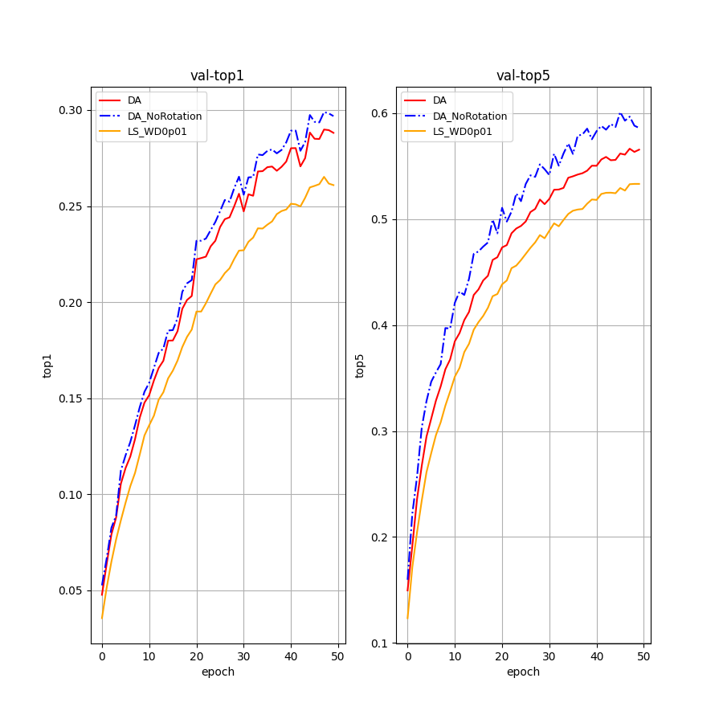

## 实验环境
python版本为3.7.16  
```bash
pip install -r requirements.txt
```
相关依赖包如下：  
einops==0.8.0  
matplotlib==3.8.2  
numpy==2.2.1  
Pillow==11.1.0  
torch==2.1.2  
torchvision==0.11.3  
tqdm==4.66.4  
## 数据集下载
使用的Tiny-Imagenet-200数据集可以在该[网站](https://www.kaggle.com/datasets/nikhilshingadiya/tinyimagenet200)中下载，克隆项目之后将数据集放置在项目下的第一级目录即可（和saved_models同级）
## 运行方式
```bash
bash run.sh
```
其内容如下：  
```bash
python run.py \
    --exp_name your_exp_name \
    --batch_size 32 \
    --epoch 50 \
    --label_smoothing 0.1 \
    --learning_rate 1e-5
```
运行完毕后，中间过程的模型文件以及loss、top1、top5结果均存储在`saved_models/your_exp_name`文件夹。
## 实验结果

<div style="text-align: center;">
  <table style="margin: auto; border-collapse: collapse;">
    <tr>
      <td style="padding: 10px; text-align: center;">
        
        <p>Change Label Smoothing(LS) and Weight Decay(WD)</p>
      </td>
      <td style="padding: 10px; text-align: center;">
        
        <p>Change Patch Size(PS) and Skip Connection(skipC)</p>
      </td>
    <td style="padding: 10px; text-align: center;">
        
        <p>Using Data Augmentation</p>
      </td>
    </tr>
  </table>
</div>

